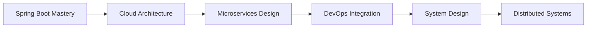

# Hi there, I'm Taha Anas 👋

<div align="center">
  
[](https://git.io/typing-svg)

</div>

## 🚀 About Me

I'm a passionate **Software Engineer** currently in my final year at ENSIAS, specializing in **backend development** and **cloud technologies**. With a strong foundation in the Java ecosystem and Spring Boot, I focus on building scalable, maintainable applications that solve real-world problems.

```yaml
name: "Taha Anas"
role: "Software Engineer"
location: "Casablanca, Morocco 🇲🇦"
focus: ["Backend Development", "Cloud Architecture", "Microservices"]
currently_learning: ["Kubernetes", "AWS Solutions Architecture", "System Design"]
fun_fact: "I believe clean code is not just about functionality, it's about craftsmanship"
```

## 🎯 What I'm Working On

- 🔭 Building **microservices architectures** with Spring Boot and Docker
- 🌱 Mastering **cloud-native development** on AWS and GCP
- 👯 Contributing to **open-source projects** in the Java ecosystem
- 📚 Exploring **DevOps practices** and CI/CD pipeline optimization
- 💬 Sharing knowledge about **clean code** and **software architecture**

## 🛠️ Tech Stack & Tools

### Backend & Languages
<p align="left">
  
  
  
  
  
  
  
</p>

### Frontend & UI
<p align="left">
  
  
  
  
  
  
</p>

### Database & Cloud
<p align="left">
  
  
  
  
  
</p>

### DevOps & Tools
<p align="left">
  
  
  
  
  
  
</p>

## 📊 GitHub Analytics

<div align="center">
  
  
</div>

<div align="center">
  
</div>

## 🏆 GitHub Trophies
<div align="center">
  
</div>

## 🌟 Featured Projects

### 🎯 [Project Name](https://github.com/taha-anas/project-name)
A brief description of your most impressive project showcasing microservices architecture with Spring Boot.
- **Tech Stack:** Java, Spring Boot, Docker, PostgreSQL
- **Key Features:** RESTful APIs, Database optimization, Containerized deployment

### 🚀 [Another Project](https://github.com/taha-anas/another-project)
Description of another significant project demonstrating your cloud and frontend skills.
- **Tech Stack:** React, Node.js, AWS, MongoDB
- **Key Features:** Real-time features, Cloud deployment, Responsive design

## 📈 Current Learning Journey



## 💡 Areas of Interest

- **🏗️ Architecture:** Microservices, Event-driven architecture, Domain-driven design
- **☁️ Cloud Technologies:** AWS Services, Google Cloud Platform, Serverless computing
- **🔧 DevOps:** CI/CD pipelines, Infrastructure as Code, Monitoring and logging
- **📊 Data:** Database optimization, Caching strategies, Data modeling
- **🎯 Best Practices:** Clean code, Testing strategies, Code reviews

## 📫 Let's Connect!

<div align="center">
  
[](https://www.linkedin.com/in/taha-anas/)
[](https://github.com/taha-anas)
[](mailto:anastaha.tech@gmail.com)

</div>

---

<div align="center">
  
  
  *"Code is like humor. When you have to explain it, it's bad." – Cory House*
</div>
